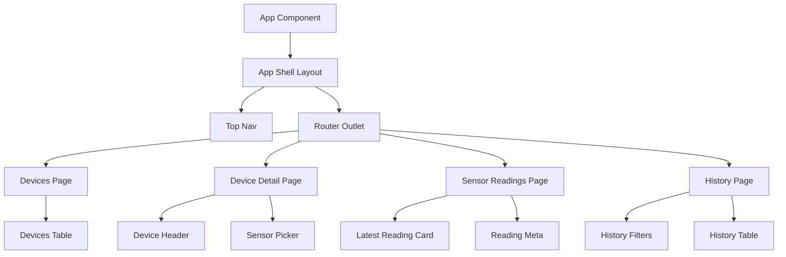

# Component Structure

```mermaid
flowchart TB
  App[App Component] --> Shell[App Shell Layout]

  Shell --> Nav[Top Nav]
  Shell --> Content[Router Outlet]

  Content --> DevicesPage[Devices Page]
  Content --> DevicePage[Device Detail Page]
  Content --> SensorPage[Sensor Readings Page]
  Content --> HistoryPage[History Page]

  DevicesPage --> DevicesTable[Devices Table]
  DevicePage --> DeviceHeader[Device Header]
  DevicePage --> SensorPicker[Sensor Picker]
  SensorPage --> LatestCard[Latest Reading Card]
  SensorPage --> ReadingMeta[Reading Meta]
  HistoryPage --> HistoryFilters[History Filters]
  HistoryPage --> HistoryTable[History Table]
```
