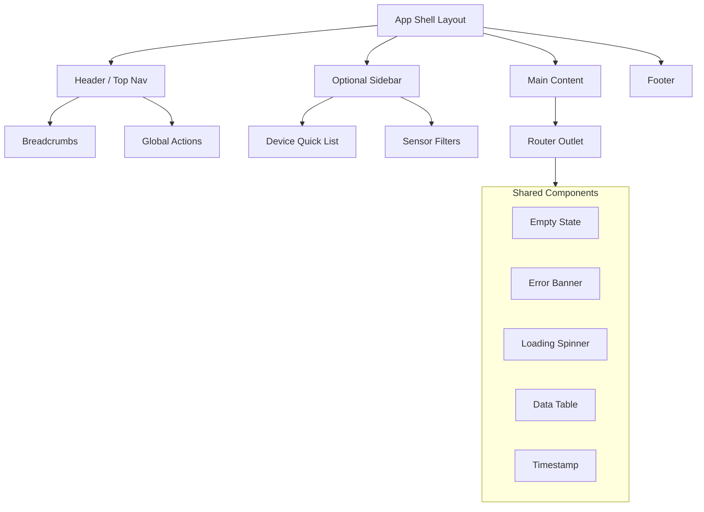

# Layout + Shared Components

```mermaid
flowchart TB
  Layout[App Shell Layout]
  Layout --> Header[Header / Top Nav]
  Layout --> Sidebar[Optional Sidebar]
  Layout --> Main[Main Content]
  Layout --> Footer[Footer]

  Header --> Breadcrumbs[Breadcrumbs]
  Header --> Actions[Global Actions]

  Sidebar --> DeviceQuickList[Device Quick List]
  Sidebar --> SensorFilters[Sensor Filters]

  Main --> Router[Router Outlet]

  subgraph Shared[Shared Components]
    EmptyState[Empty State]
    ErrorBanner[Error Banner]
    LoadingSpinner[Loading Spinner]
    DataTable[Data Table]
    Timestamp[Timestamp]
  end

  Router --> Shared
```
