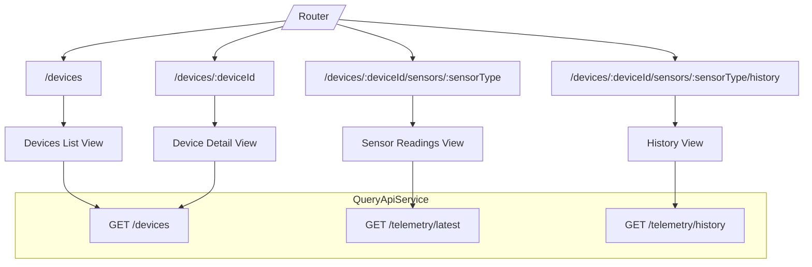

# Routing + Data Flow

```mermaid
flowchart TB
  %% Routing
  R[/Router/]
  R --> D["/devices"]
  R --> DD["/devices/:deviceId"]
  R --> SR["/devices/:deviceId/sensors/:sensorType"]
  R --> H["/devices/:deviceId/sensors/:sensorType/history"]

  %% Pages
  D --> Dlist[Devices List View]
  DD --> Ddetail[Device Detail View]
  SR --> Sread[Sensor Readings View]
  H --> Shist[History View]

  %% Services
  subgraph API[QueryApiService]
    A1["GET /devices"]
    A2["GET /telemetry/latest"]
    A3["GET /telemetry/history"]
  end

  Dlist --> A1
  Ddetail --> A1
  Sread --> A2
  Shist --> A3
```
